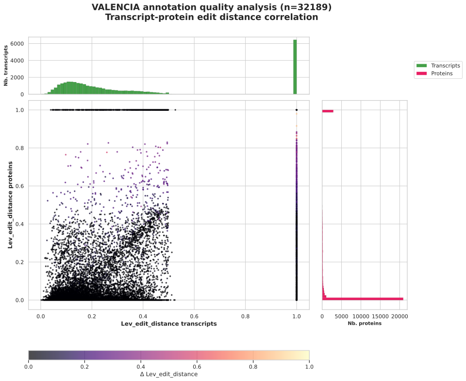
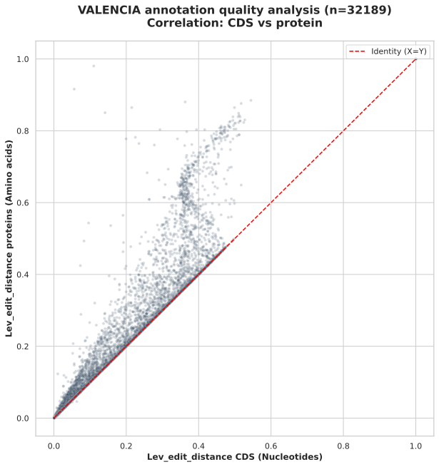
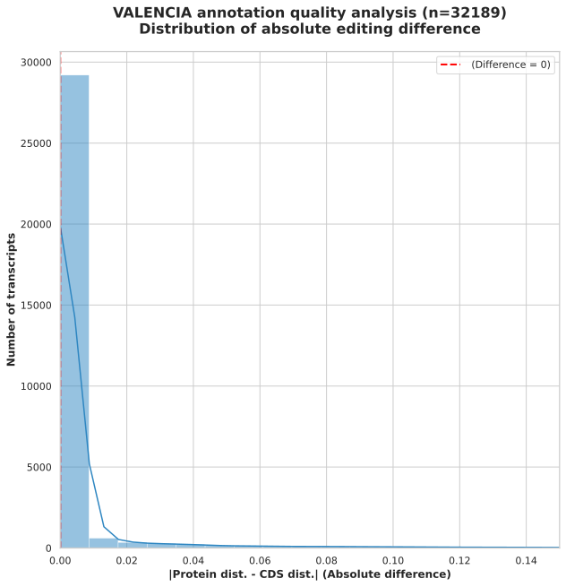

## Table of contents
- [VALENCIA - Validating Annotation Levels Employing Nucleotide Comparison Identity Analysis](#valencia---validating-annotation-levels-employing-nucleotide-comparison-identity-analysis)
- [Requirements](#requirements)
- [Installation](#installation)
- [Usage](#usage)
- [What VALENCIA does](#what-valencia-does)
- [VALENCIA PLOTS](#valencia-plots)

# VALENCIA - Validating Annotation Levels Employing Nucleotide Comparison Identity Analysis
The main objective of this work is the design, development, and implementation of VALENCIA, a tool aimed at evaluating the quality of genome annotations by using experimental data such as transcripts and protein sequences.

## Requirements
### Python dependencies
- Python == 3.13.12
- pandas, matplotlib, seaborn, numpy, biopython, python-levenshtein


### Software dependencies

- conda == 26.6.1
- Bioconda: agat == 1.6.1
- GFFread == 0.12.7 (https://github.com/gpertea/gffread)
- GFFcompare == 0.12.10 (https://github.com/gpertea/gffcompare)

[Back to Table of contents](#table-of-contents)

## Installation
Follow the steps below to set up the environment required to run VALENCIA.


```bash
# Create and activate the conda environment:
conda create -n valencia_env python=3.13.12
conda activate valencia_env
```


```bash
# Install Python dependencies:
pip install -r requirements.txt
```
```bash
# Install external tools:
conda install -c bioconda agat gffread gffcompare
```
```bash
# Verify installation
gffread --version
gffcompare --version
agat --help
```
[Back to Table of contents](#table-of-contents)

## Usage

VALENCIA evaluates genome annotations by comparing a target file against two types of biological evidence (transcriptome and protein). To run the pipeline, the following parameters are required:

- Transcriptome evidence (-t, --transcriptome_evidence): GFF/GTF annotation containing evidence from RNA-Seq or transcriptomic data.

- Protein evidence (-p, --protein_evidence): GFF/GTF annotation containing evidence from protein sequences.

- Genome assembly (-g, --genome_assembly): The reference genome sequence in FASTA format.

- Annotation target (-x, --annotation_target): The target annotation (GFF/GTF) that you wish to evaluate.

- Outbase (-o, --outbase): The output directory or base name where all results and plots will be stored.

Example command

The following command illustrates a typical execution of VALENCIA using your provided structure:
```
python3 VALENCIA/VALENCIA.py \
    -t INPUTS/Arabidopsis_thaliana/Artha_AllRNASeq.STAR.TAIR10.EVT_STv1.gff3 \
    -p INPUTS/Arabidopsis_thaliana/Arabidopsis_thaliana_GeMoMa_with_Oryza_sativa.gff \
    -g INPUTS/Arabidopsis_thaliana/Athaliana_447_TAIR10.fa \
    -x INPUTS/Arabidopsis_thaliana/Athaliana_447_Araport11.gene_exons.gff3 \
    -o test_valencia_araport1
```
## What VALENCIA does

### 1. Automated sequence extraction (Gffread) (https://github.com/gpertea/gffread)
    
Using the **GffRead** utility, VALENCIA automates the extraction of biological sequences by cross-referencing the GFF3 annotation with the genome assembly (FASTA).    
This stage generates two directories (target and evidence) to facilitate comparison at three distinct biological levels (transcript, CDS, and protein). 

 ```bash
 output:
 target_sequences/
 evidence_sequences/
```
Files generated in both directories:
 - ```.transcripts.fa:``` FASTA files that contain the full mRNA sequences. These include the concatenation of all exon and UTR regions. 
 - ```.cds.fa:``` FASTA files that contain only the coding sequences (from start codon to the stop codon).
- ```.proteins.fa:``` FASTA files that contain the in silico translations of the CDS.


  
### 2. Structural comparison (Gffcompare) (https://github.com/gpertea/gffcompare)
    
VALENCIA runs **GffCompare** to perform a spatial comparison between the exon-intron architectures of the target and the evidence. This step is crucial for:
    
 - **Classification via Class Codes:** Categorizing each transcript based on its structural relationship with the reference 

- **Accuracy estimation:** Calculating sensitivity and precision at the base, exon, and locus levels.

```
output:
gffcompare_results/
```
Files generated in the directory (for each evidence):

- ```.annotated.gtf:``` The structural output file where each transcript is enriched with attribute tags containing its assigned Class Code.

- ```.stats:``` Summary report providing the global accuracy metrics (sensitivity and precision) at the base, exon and locus levels.

- ```.tracking:``` File that maintains a unique mapping identifier across datasets, ensuring traceability between the target annotation and the evidence.

- ```.refmap:``` File that identifies which query transcripts match each reference transcript, used to evaluate annotation sensitivity.

- ```tmap:``` File that lists the best-matching reference transcript for each query transcript, serving as the primary relational map for sequence comparison. 


### 3. Sequence-level evaluation (Levenshtein distance)

In this module, VALENCIA implements an advanced sequence validation algorithm inspired by the Annotation Edit Distance (AED) metric. By utilizing the ```Levenshtein``` and ```Biopython``` libraries, the tool quantifies the biological divergence between predicted models and experimental evidence.

- Shared bases calculation: The number of matching bases is derived from the Levenshtein distance ($D_L$) relative to the longest sequence. 

$Shared = \max(L_{target}, L_{evidence}) - D_L$.
    

Metric:

$$Sn = \frac{Shared}{L_{evidence}}$$

 $$Sp = \frac{Shared}{L_{target}}$$
     
     
$$Distance = 1 - \left( \frac{Sn + Sp}{2} \right)$$
- Indexing: VALENCIA uses ```SeqIO.index``` for retrieval of sequences from transcripts, CDS, and protein FASTA files, ensuring an exact 1:1 comparison via the IDs mapped in the ```.tmap``` file.


### 4. Integrated quality reporting and visualization.

The final stage of VALENCIA synthesizes the structural and sequence-level data into a definitive annotation file and visual diagnostic panels.

The output of the pipeline. This GFF3 file retains the original genomic coordinates but is enriched with attribute tags from results of VALENCIA in the 9th column for every transcript.

Tags: 
     
 ```class_code```, ```match_id```, ```transcripts_edit_distance```, ```cds_edit_distance``` and ```proteins_edit_distance```.

Plots:

```VALENCIA_quality_correlation_scatter.svg```

```VALENCIA_CDS_protein_correlation.svg```

```VALENCIA_edit_distance_distribution.svg```

[Back to Table of contents](#table-of-contents)

## VALENCIA PLOTS

The visualization module in VALENCIA provides a multi-level diagnostic to assess the structural and functional fidelity of genome annotations. By integrating Levenshtein distance ($D_L$) across different biological layers, the tool quantifies the congruence between predicted models and experimental evidence.

### **Figure 1. VALENCIA_quality_correlation_scatter.svg**

<p align="center">
  
</p>

This bivariate analysis evaluates the synergy between the structural model (transcript) and its functional result (protein).
 
- Correlation analysis: The scatter plot visualizes the consistency of the annotation. A high density of data points at the origin $(0,0)$ signifies models where both the predicted exon structure and the resulting protein sequence are fully supported by biological evidence.

- Outlier identification: Data points located at the coordinates $(1,1)$ highlight "orphan" predictions or sequences with zero experimental support

- Marginal plots:
        
- Transcripts (green, top): Represent the global distribution of structural accuracy.
- Proteins (pink, right): Represent the global distribution of functional accuracy.

 ### **Figure 2. VALENCIA_CDS_protein_correlation.svg**
   

<p align="center">
  
</p>

This correlation analysis between CDS and protein edit distances for identifying errors in the translation process.

- Line (X = Y): The edit distance at the nucleotide level (CDS) should be proportional to the distance at the amino acid level.

- Above the identity line: Data points positioned above the identity line indicate a significant discrepancy where a minimal edit distance in the CDS leads to a disproportionate distance in the protein.

### **Figure 3. VALENCIA_edit_distance_distribution.svg**

<p align="center">
  
</p>


This plot provides a global metric calculating the absolute discrepancy  
    
$|D_{L(Protein)} - D_{L(CDS)}|$

- The peak at 0: The primary bar at 0 represents genes where the error is identical in both the nucleotide and the amino acid sequences.

- Error discrepancies: Any data spreading to the right represents models where the error at the protein level does not match the error at the CDS level.

- The line over the bars is a statistical tool used to visualize the "shape" of the quality. Its main purpose is to allow quick comparison between different annotations or genomes. 


[Back to Table of contents](#table-of-contents)


